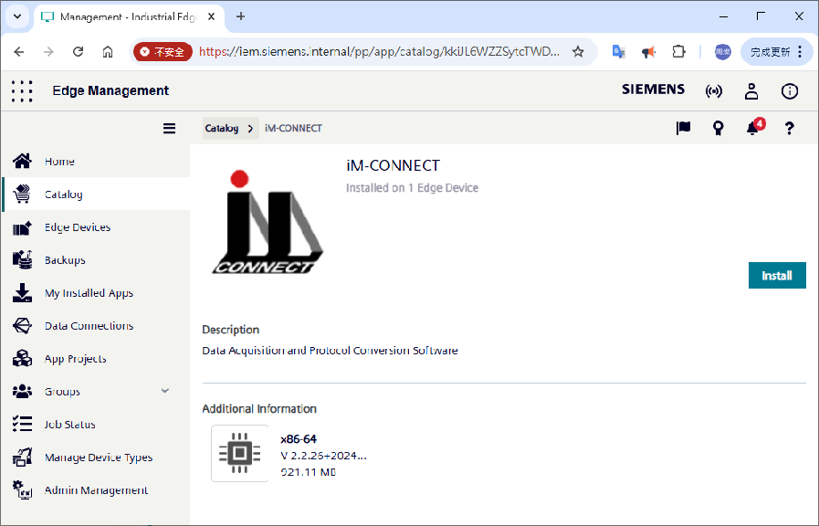
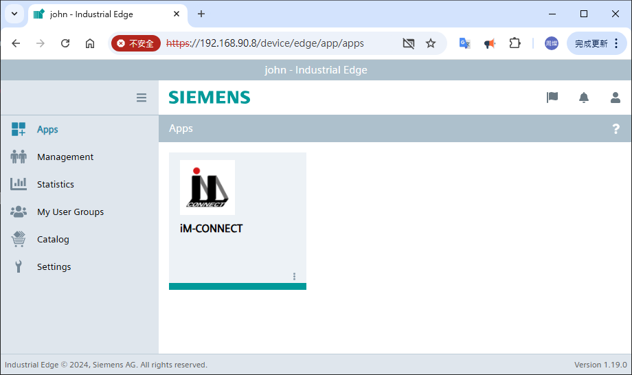

iM-Connect® is a web-based and simple-to-use programming software developed by NOVAKON Co., Ltd., 
that supports a variety of industrial communication protocols, PLC drivers, and IIOT cloud 
connections as a simple but reliable protocol conversion and data acquisition platform for 
the "Connected" industries.

## Table of Contents

1. [Installation](#installation)
2. [Usage](#usage)
3. [Configuration](#configuration)
4. [Examples](#examples)
5. [Contributing](#contributing)
6. [License](#license)

## Installation
Follow the steps below to install the application.
1. Open the [Industrial Edge Hub](https://dahocove.iehub.eu1.edge.siemens.cloud/) website and Copy latest version to IEM(s)
2. Open the [Industrial Edge Management](https://blank) and install iM-CONNECT on Edge Device.<br>
<br>
3. Open the [Industrial Edge Device](https://blank) and control the application.

### Usage
1. Open the IED in the browser and click the iM-CONNECT icon<br>

2. Please refer to [the user manula](https://www.novakon.com.tw/common/frontend/download?path=/uploads/images/support/download/IM-Connect_User_Guide_Novakon_EN.pdf) to operate the software on Edge Device

## Configuration

To configure the project, follow these steps:

## Examples
- [Start Simulation](http://34.81.108.66:9001/) Click the button to start the online simulation （Username: simulation / Password: novakon）
- [Software Tutorial](https://www.novakon.com.tw/en/software/detail/iM_Connect) Open the website and tab labeled "Software Tutorial" on the page.

## License
<!-- 表格 -->
<table>
    <tr>
        <th align="left" valign="bottom">Library/Component</th>
        <th align="left" valign="bottom">License</th>
    </tr>
    <tr>
        <td align="left" valign="top">Node.js</td>
        <td align="left" valign="top"><a href="#libraryA">MIT</a></td>
    </tr>
    <tr>
        <td align="left" valign="top">Qt 4.8.7</td>
        <td align="left" valign="top"><a href="#libraryB">LGPLv2.1</a></td>
    </tr>
    <tr>
        <td align="left" valign="top">BootstrapVue</td>
        <td align="left" valign="top"><a href="#libraryC">MIT</a></td>
    </tr>
    <tr>
        <td align="left" valign="top">ECharts</td>
        <td align="left" valign="top"><a href="#libraryD">Apache v2.0</a></td>
    </tr>
    <tr>
        <td align="left" valign="top">open62541</td>
        <td align="left" valign="top"><a href="#libraryE">MPLv2</a></td>
    </tr>
    <tr>
        <td align="left" valign="top">express</td>
        <td align="left" valign="top"><a href="#libraryF">MIT</a></td>
    </tr>
    <tr>
        <td align="left" valign="top">mqtt</td>
        <td align="left" valign="top"><a href="#libraryG">MIT</a></td>
    </tr>
    <tr>
        <td align="left" valign="top">mysql</td>
        <td align="left" valign="top"><a href="#libraryH">MIT</a></td>
    </tr>
    <tr>
        <td align="left" valign="top">mssql</td>
        <td align="left" valign="top"><a href="#libraryI">MIT</a></td>
    </tr>
    <tr>
        <td align="left" valign="top">nodemailer</td>
        <td align="left" valign="top"><a href="#libraryJ">MIT</a></td>
    </tr>
    <tr>
        <td align="left" valign="top">cors</td>
        <td align="left" valign="top"><a href="#libraryK">MIT</a></td>
    </tr>
    <tr>
        <td align="left" valign="top">ftp</td>
        <td align="left" valign="top"><a href="#libraryL">MIT</a></td>
    </tr>
    <tr>
        <td align="left" valign="top">asyncawait</td>
        <td align="left" valign="top"><a href="#libraryM">MIT</a></td>
    </tr>
    <tr>
        <td align="left" valign="top">node-jsonwebtoken</td>
        <td align="left" valign="top"><a href="#libraryN">MIT</a></td>
    </tr>
    <tr>
        <td align="left" valign="top">Vue</td>
        <td align="left" valign="top"><a href="#libraryO">MIT</a></td>
    </tr>
    <tr>
        <td align="left" valign="top">light-vue-tree</td>
        <td align="left" valign="top"><a href="#libraryP">MIT</a></td>
    </tr>
</table>
<hr>
<!-- 詳細內容Node.js -->
<div class="license-card">
    <div class="library-name" id="libraryA" style="font-size: 1.5em;">Node.js</div>
    <div class="content-container">
        <div class="content">
            <h4 style="margin-top:10px; margin-bottom: -20px;">Node.js is a cross-platform, open-source server environment, Node.js is a back-end JavaScript runtime environment.<br> Contact:<a href="https://nodejs.org/">https://nodejs.org/</a></h4>
            <h4 style="margin-bottom: -20px;">Node.js is available under the MIT.</h4>
            <h4>Reference:<a href="https://en.wikipedia.org/wiki/MIT_License">GNU Lesser General Public License, version 2.1</a></h4>
        </div>
    </div>
</div>
<!-- 詳細內容Qt 4.8.7 -->
<div class="license-card">
    <div class="library-name" id="libraryB" style="font-size: 1.5em;">Qt 4.8.7</div>
    <div class="content-container">
        <div class="content">
            <h4 style="margin-top:10px; margin-bottom: -20px;">The Qt GUI Toolkit is Copyright (C) 2013 Digia Plc and/or its subsidiary(-ies).<br> Contact:<a href="http://www.qt-project.org/legal">http://www.qt-project.org/legal</a></h4>
            <h4 style="margin-bottom: -20px;">Qt is available under the LGPL.</h4>
            <h4>Reference:<a href="https://www.gnu.org/licenses/old-licenses/lgpl-2.1.html">GNU Lesser General Public License, version 2.1</a></h4>
        </div>
    </div>
</div>
<!-- 詳細內容Bootstrap-vue -->
<div class="license-card">
    <div class="library-name" id="libraryC" style="font-size: 1.5em;">BootstrapVue</div>
    <div class="content-container">
        <div class="content">
            <h4 style="margin-top:10px; margin-bottom: -20px;">BootstrapVue is distributed under The MIT License (MIT)</h4>
            <h4>Reference:<a href="https://bootstrap-vue.org/">https://bootstrap-vue.org/</a></h4>
        </div>
    </div>
</div>
<!-- 詳細內容echart -->
<div class="license-card">
    <div class="library-name" id="libraryD" style="font-size: 1.5em;">ECharts</div>
    <div class="content-container">
        <div class="content">
            <h4 style="margin-top:10px; margin-bottom: -20px;">ECharts is distributed under Apache License Version 2.0.</h4>
            <h4>Reference:<a href="https://echarts.apache.org/">https://echarts.apache.org/</a></h4>
        </div>
    </div>
</div>
<!-- 詳細內容 open62541 -->
<div class="license-card">
    <div class="library-name" id="libraryE" style="font-size: 1.5em;">open62541</div>
    <div class="content-container">
        <div class="content">
            <h4 style="margin-top:10px; margin-bottom: -20px;">open62541 is licensed under the Mozilla Public License 2.0</h4>
            <h4>Reference:<a href="https://github.com/open62541/open62541/blob/master/LICENSE">https://www.open62541.org/</a>
            </h4>
        </div>
    </div>
</div>
<!-- 詳細內容 express -->
<div class="license-card">
    <div class="library-name" id="libraryF" style="font-size: 1.5em;">express</div>
    <div class="content-container">
        <div class="content">
            <h4 style="margin-top:10px; margin-bottom: -20px;">Copyright (c) 2009-2014 TJ Holowaychuk <tj@vision-media.ca><br>
                Copyright (c) 2013-2014 Roman Shtylman <shtylman+expressjs@gmail.com><br>
                Copyright (c) 2014-2015 Douglas Christopher Wilson <doug@somethingdoug.com></h4>
            <h4>Reference:<a href="http://expressjs.com/en/starter/installing.html">http://expressjs.com/en/starter/installing.html</a>
            </h4>
        </div>
    </div>
</div>
<!-- 詳細內容 mqtt -->
<div class="license-card">
    <div class="library-name" id="libraryG" style="font-size: 1.5em;">MQTT</div>
    <div class="content-container">
        <div class="content">
            <h4 style="margin-top:10px; margin-bottom: -20px;">Copyright (c) 2015-2016 MQTT.js contributors</h4>
            <h4>Reference:<a href="https://github.com/mqttjs/MQTT.js#contributors">https://github.com/mqttjs/MQTT.js#contributors</a>
            </h4>
        </div>
    </div>
</div>
<!-- 詳細內容 mysql -->
<div class="license-card">
    <div class="library-name" id="libraryH" style="font-size: 1.5em;">mysql</div>
    <div class="content-container">
        <div class="content">
            <h4 style="margin-top:10px; margin-bottom: -20px;">Copyright (c) 2012 Felix Geisendörfer (felix@debuggable.com) and contributors
            Permission is hereby granted.</h4>
            <h4>Reference:<a href="https://github.com/open62541/open62541/blob/master/LICENSE">https://www.open62541.org/</a>
            </h4>
        </div>
    </div>
</div>
<!-- 詳細內容node-mssql -->
<div class="license-card">
    <div class="library-name" id="libraryI" style="font-size: 1.5em;">node-mssql</div>
    <div class="content-container">
        <div class="content">
            <h4 style="margin-top:10px; margin-bottom: -20px;">Contributions are very welcome!</h4>
            <h4>Reference:<a
                    href="https://github.com/tediousjs/node-mssql/wiki/Contributing">https://github.com/tediousjs/node-mssql/wiki/Contributing</a>
            </h4>
        </div>
    </div>
</div>
<!-- 詳細內容 nodemailer -->
<div class="license-card">
    <div class="library-name" id="libraryJ" style="font-size: 1.5em;">nodemailer</div>
    <div class="content-container">
        <div class="content">
            <h4 style="margin-top:10px; margin-bottom: -20px;">Copyright (c) 2011-2016 Andris Reinman.</h4>
            <h4>Reference:<a href="https://github.com/nodemailer/nodemailer">https://github.com/nodemailer/nodemailer</a>
            </h4>
        </div>
    </div>
</div>
<!-- 詳細內容 cors -->
<div class="license-card">
    <div class="library-name" id="libraryK" style="font-size: 1.5em;">cors</div>
    <div class="content-container">
        <div class="content">
            <h4 style="margin-top:10px; margin-bottom: -20px;">Copyright (c) 2013 Troy Goode <troygoode@gmail.com>.</h4>
            <h4>Reference:<a href="https://github.com/expressjs/cors">https://github.com/expressjs/cors</a>
            </h4>
        </div>
    </div>
</div>
<!-- 詳細內容 ftp -->
<div class="license-card">
    <div class="library-name" id="libraryL" style="font-size: 1.5em;">ftp</div>
    <div class="content-container">
        <div class="content">
            <h4 style="margin-top:10px; margin-bottom: -20px;">Copyright Brian White. All rights reserved.</h4>
            <h4>Reference:<a href="https://github.com/jlaffaye/ftp">https://github.com/jlaffaye/ftp</a>
            </h4>
        </div>
    </div>
</div>
<!-- 詳細內容 asyncawait -->
<div class="license-card">
    <div class="library-name" id="libraryM" style="font-size: 1.5em;">asyncawait</div>
    <div class="content-container">
        <div class="content">
            <h4 style="margin-top:10px; margin-bottom: -20px;">Copyright (c) 2014-2016 Troy Gerwien.</h4>
            <h4>Reference:<a href="https://github.com/yortus/asyncawai">https://github.com/yortus/asyncawai</a>
            </h4>
        </div>
    </div>
</div>
<!-- 詳細內容 jsonwebtoken -->
<div class="license-card">
    <div class="library-name" id="libraryN" style="font-size: 1.5em;">node-jsonwebtoken</div>
    <div class="content-container">
        <div class="content">
            <h4 style="margin-top:10px;">Reference:<a href="https://github.com/auth0/node-jsonwebtoken">https://github.com/auth0/node-jsonwebtoken</a>
            </h4>
        </div>
    </div>
</div>
<!-- 詳細內容 Vue -->
<div class="license-card">
    <div class="library-name" id="libraryO" style="font-size: 1.5em;">Vue</div>
    <div class="content-container">
        <div class="content">
            <h4 style="margin-top:10px;">Reference:<a href="https://vuejs.org">https://vuejs.org</a>
            </h4>
        </div>
    </div>
</div>
<!-- 詳細內容  light-vue-tree-->
<div class="license-card">
    <div class="library-name" id="libraryP" style="font-size: 1.5em;">light-vue-tree</div>
    <div class="content-container">
        <div class="content">
            <h4 style="margin-top:10px;">Reference:<a href="https://github.com/Create-Peace/light-vue-tree">https://github.com/Create-Peace/light-vue-tree</a>
            </h4>
        </div>
    </div>

### Prerequisites

Ensure you have the following installed:
- [Industrial Edge Hub](https://docs.eu1.edge.siemens.cloud/get_started_and_operate/industrial_edge_hub/setup/ieh_index.html) Login IEH and create IEM instance.
- [Industrial Edge Management](https://docs.eu1.edge.siemens.cloud/get_started_and_operate/industrial_edge_management/overview.html) Install iM-CONNECT application on Edge Device
- [Industrial Edge Device](https://docs.eu1.edge.siemens.cloud/get_started_and_operate/industrial_edge_device/setup_onboarding/sign_up/sign_up_with_configurated_email_server.html) Control iM-CONNECT application.

### Steps

Clone the repository and install the dependencies:

```bash
git clone https://github.com/JohnLiao-source/siemens.git
cd siemens
